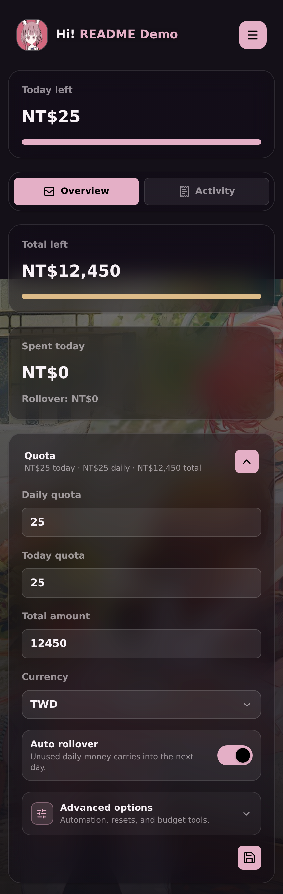
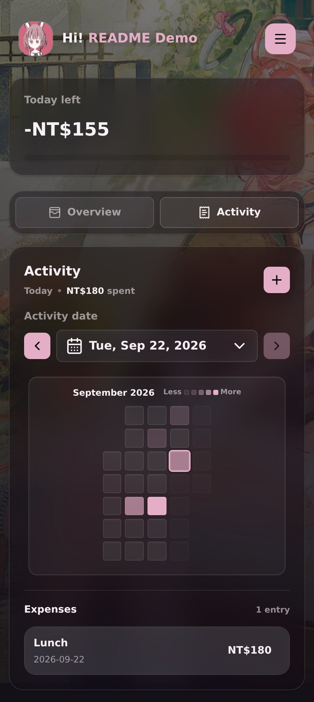

# 💸 Budget


A small, self-hosted budget tracker that helps you keep an eye on daily spending without a complicated setup.

✨ **No npm install. No build step. Just Node.js and a browser.**

> [!IMPORTANT]
> This project is mostly vibe coded with GPT-5.5 and GPT-5.6 Sol.
> Support and bug fixes are not guaranteed.

## 👀 A quick look

<table>
  <tr>
    <td align="center">
      
      <br />
      <sub><b>💰 Quota controls</b> — currency, rollover, and advanced budget options.</sub>
    </td>
    <td align="center">
      
      <br />
      <sub><b>📅 Activity</b> — pick a day and see your spending heatmap.</sub>
    </td>
  </tr>
</table>

## ✨ What it can do

- 💰 Track a daily quota and total budget
- 🧾 Add, edit, and delete expenses
- 📅 See how much you spent on a selected day
- 🔥 Browse spending with the Activity heatmap
- ➡️ Carry unused daily money forward with **Auto rollover**
- 🧮 Split your remaining budget across a chosen number of days
- 🔁 Reset your budget automatically each month
- 💱 Use different currencies
- 👤 Keep multiple local profiles with PINs
- 💾 Remember a profile on your device
- 🖼️ Upload a background by file picker, drag-and-drop, or paste
- 🎨 Generate interface colors from your background image
- 📱 Work on desktop and mobile
- 🤖 Run through the optional Android app

## 🚀 Quick start

You only need **Node.js 18 or newer**.

### 1. Download the project

If you have Git installed:

```bash
git clone https://github.com/Rynowastaken/budget.git
cd budget
```

Don't use Git yet? No problem — download the repository as a ZIP from GitHub and extract it.

### 2. Start Budget

```bash
node server.js
```

### 3. Open it

Visit:

```text
http://localhost:4173
```

🎉 That's it. There is no `npm install` and no build command.

## 👋 First-time setup

When the login screen opens:

1. Leave **Saved profiles** on **New profile**.
2. Enter a profile name.
3. Add a PIN if you want one.
4. Turn on **Remember me** if you want this browser to open the profile automatically.
5. Press the login button.

If the profile name does not already exist, Budget creates it for you automatically.

## 🧭 Using Budget

### 💰 Set your budget

Open **Overview → Quota**.

The main options are:

- **Daily quota** — how much you want available each day.
- **Today quota** — a one-day override for the current day.
- **Total amount** — your available budget.
- **Currency** — controls how money is displayed.
- **Auto rollover** — carries unused daily money into the next day.

Less common tools live inside **Advanced options**, so the main screen stays tidy.

### ➕ Add an expense

Open **Activity**, choose a date, then press **+**.

The new expense automatically follows the date you selected.

You can enter:

- 💵 an amount
- 🏷️ a name
- 📅 a date

Budget also remembers recent expense names to make repeated entries quicker.

### 🔥 Activity and heatmap

The Activity page shows:

- 📅 the selected date
- 💸 the total spent on that date
- 🧾 expenses for that date
- 🟪 a heatmap of spending for the selected month

Tap a heatmap square to select that day.

On mobile:

- 👈👉 swipe the Activity date to move between days
- 🗓️ swipe the heatmap to browse months
- 🤏 pinch the heatmap to zoom
- ✋ drag a zoomed heatmap to pan
- 👈 swipe an expense left to reveal **Edit** and **Delete**

Future dates cannot be selected for expenses.

## 🖼️ Backgrounds and appearance

Open the hamburger menu and choose **Upload**.

You can:

- 🖱️ drag an image into the upload window
- 📁 choose one from your files
- 📋 paste an image with **Ctrl+V** or **⌘V**

A preview appears before the image is applied.

Budget resizes/compresses the image and creates a matching color palette for the interface.

Choose **Clear** to remove the uploaded background and return to the default appearance. Clearing the background does **not** delete your budget or expenses.

## 🌐 Use Budget on another device

By default, the server listens on port `4173` and can be reached by other devices on your local network.

Find the local IP address of the computer running Budget, then open something like:

```text
http://192.168.1.100:4173
```

Your exact IP address will be different.

If it does not connect, check that:

- 📶 both devices are on the same network
- 🟢 `node server.js` is still running
- 🧱 your firewall allows port `4173`

### Change the port

For example, to use port `8080`:

```bash
PORT=8080 node server.js
```

To only allow connections from the same computer:

```bash
HOST=127.0.0.1 node server.js
```

## 💾 Where your data is stored

Profile and budget data is stored in:

```text
data/finance-db.json
```

Uploaded backgrounds are stored in:

```text
uploads/
```

Want a backup? Copy both of those locations somewhere safe.

It is best to stop the server before replacing `finance-db.json` with a backup.

> [!WARNING]
> These files can contain private financial information. Do not commit `data/` or `uploads/` to a public repository.

A useful `.gitignore` is:

```gitignore
data/
uploads/
android/.gradle/
android/build/
android/app/build/
android/local.properties
```

## 🤖 Android app

The `android/` folder contains an optional Android WebView wrapper.

It does **not** replace the server. The Android app connects to a computer or server that is already running Budget.

For a phone on the same Wi-Fi network, use an address such as:

```text
http://192.168.1.100:4173
```

For the standard Android emulator, the host computer is available at:

```text
http://10.0.2.2:4173
```

For build instructions, see [android/README.md](android/README.md).

## 🔒 Important security note

Budget is designed mainly for personal use on a trusted device or local network.

The built-in server does **not** provide everything you would expect from a production internet-facing service, such as:

- HTTPS
- rate limiting
- account recovery
- production-grade session management

PINs are salted and hashed when stored, but credentials are still sent with API requests.

⚠️ **Do not expose the built-in server directly to the public internet.** If you need remote access, put it behind HTTPS and proper access controls.

## 🗂️ Project layout

```text
.
├── index.html
├── server.js
├── assets/
│   ├── css/app.css
│   └── js/app.js
├── docs/
│   └── screenshots/
├── vendor/
├── android/
├── data/
└── uploads/
```

The important files are:

- 📄 `index.html` — page structure
- 🎨 `assets/css/app.css` — styling and responsive layout
- ⚙️ `assets/js/app.js` — frontend behavior
- 🖥️ `server.js` — web server, API, profiles, and storage

## 🛠️ Making changes

There is no frontend build step.

Edit the files, save them, and refresh your browser.

You can check the JavaScript for syntax errors with:

```bash
node --check assets/js/app.js
node --check server.js
```

Want to run a second copy while testing?

```bash
PORT=4174 node server.js
```

## 📜 License

There is currently no license file in this repository.
